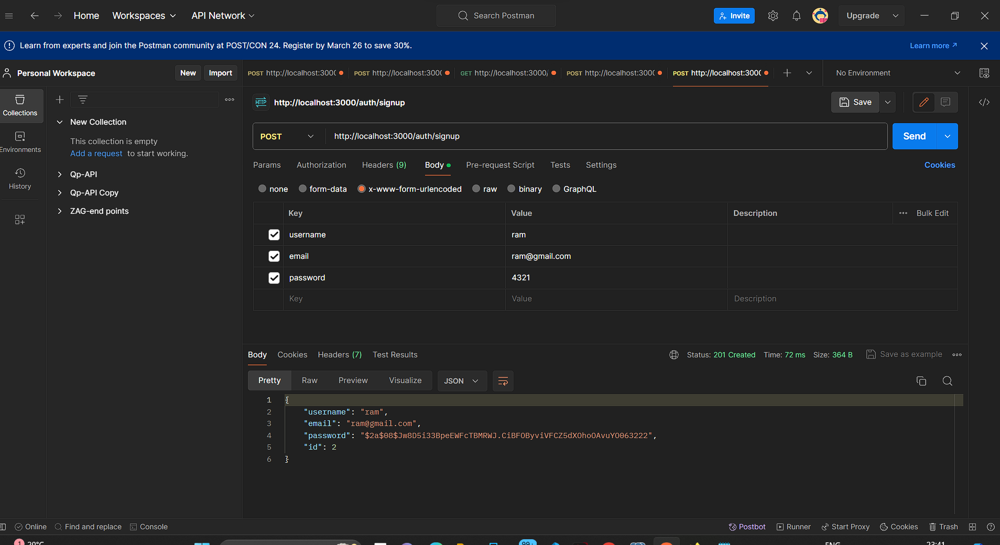
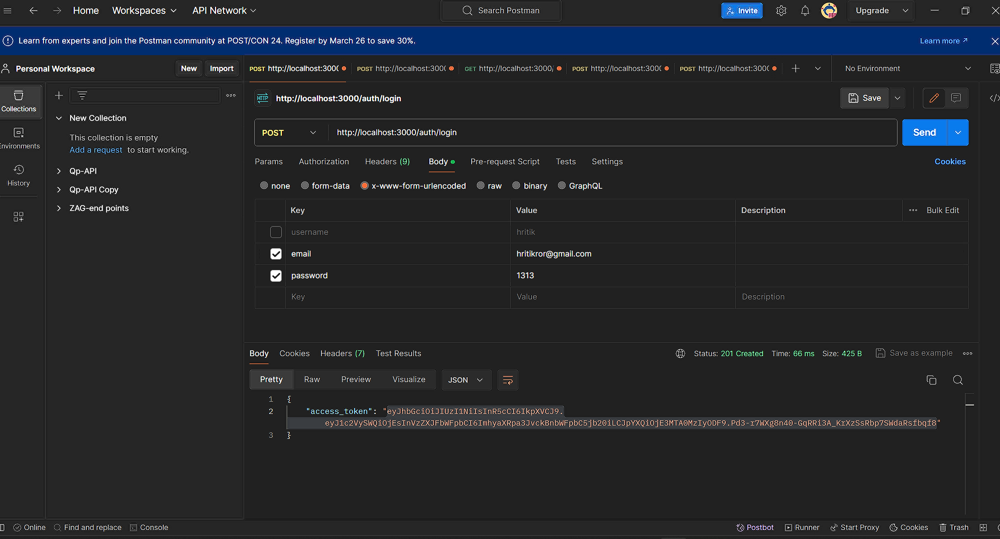
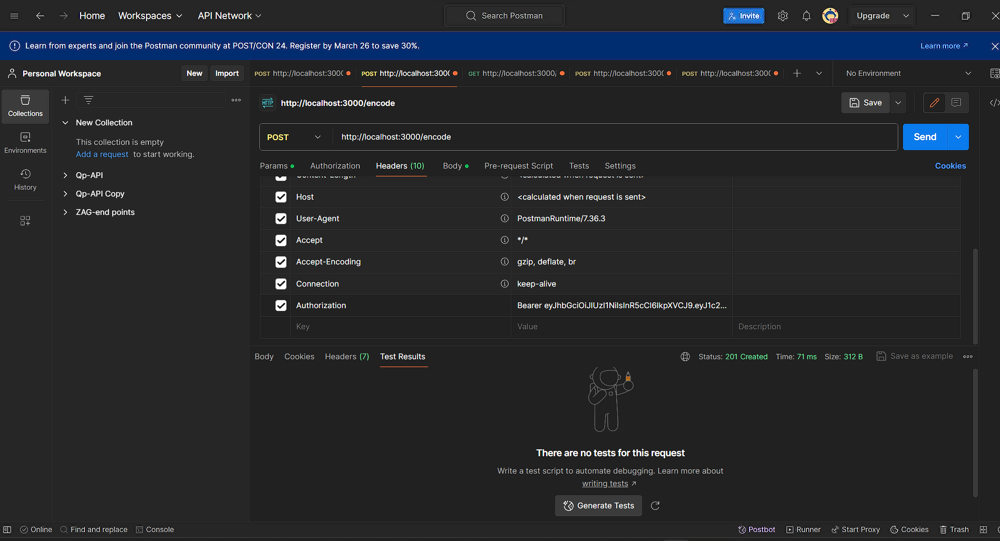
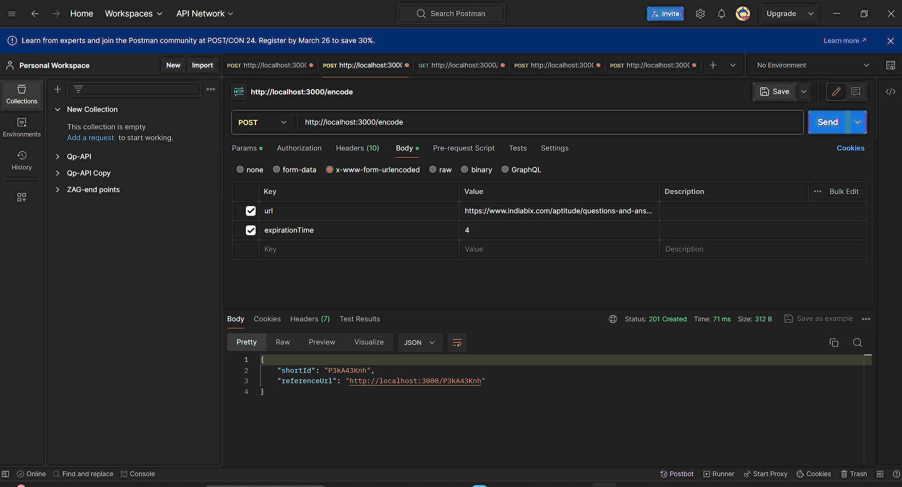
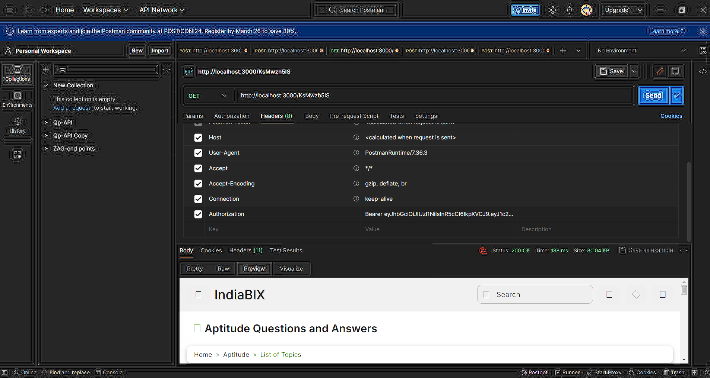
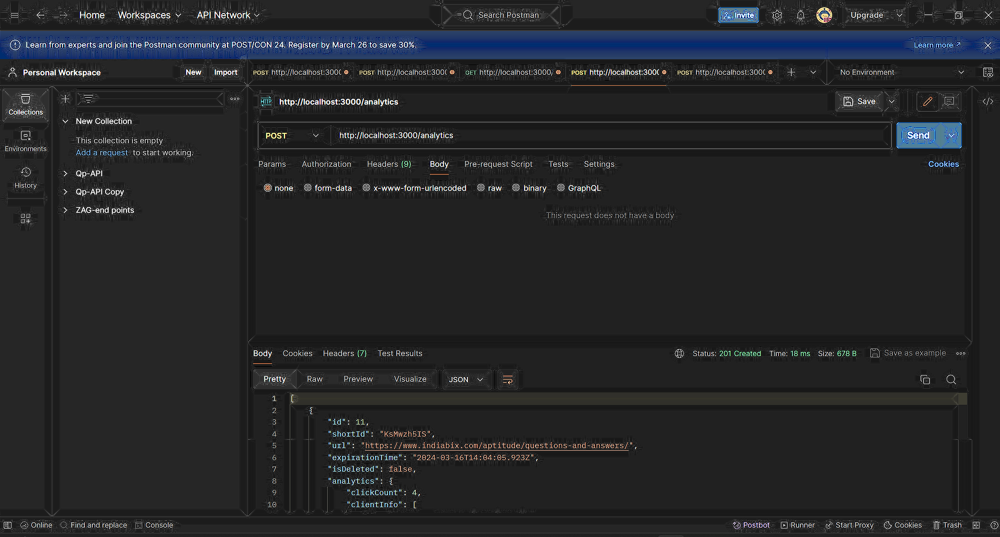

## Installation

```bash
$ npm install or npm install --force

.env file for DB configuration (Postgres)

```

## Running the app

```bash
# development
$ npm run start

# watch mode
$ npm run start:dev

# production mode
$ npm run start:prod
```

* Jwt authentication and authorization implemented using Passport-jwt strategy
* Use middleware to authenticate
* Cron Job (scheduler) implemented which check every 5th second expirationTime become less than currentTime(Soft delete Url)
* input validation and sanitization implemented for security concern using class-validator package and Pipes
* Analytics singly handled in Json column (URL entity)
* Redis skipped due to low system configuration of personal laptop(RAM limit)


API to test given below:-

create user



login 



use jwt token in headers (Authorization = Bearer 'token')




use shortUrl




analytics


more info -> contact -> hritikror@gmail.com